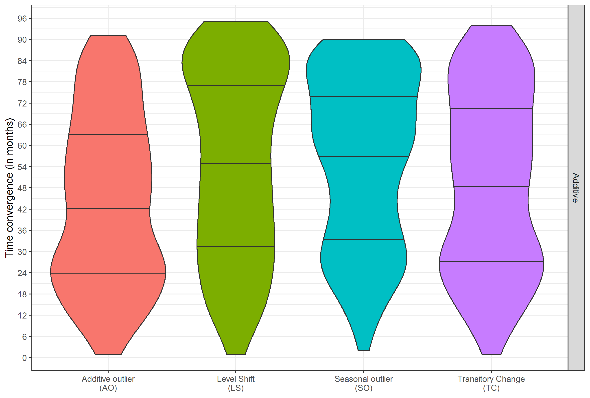

```{r setup, include=FALSE}
library(knitr)
library(kableExtra)
knitr::opts_chunk$set(echo = FALSE,warning = FALSE)
```

###  Introduction to the seasonal adjustment procedure

\centering
\includegraphics[height = 0.9\textheight]{img/MethodesX13-TS.png}

### Mathematical Writing of Reg-ARIMA
Mathematical writing of the Reg-ARIMA Model in Seasonal Adjustment:

$$
 \begin{drcases}
\text{Additive: }& Y_t \\
\text{Multiplicative: }& \log(Y_t) 
\end{drcases} 
= \underbrace{\beta_0 LY_t + \beta_1 WD_t}_{\text{WD regressors}} + 
\underbrace{\sum_{i}\gamma_iO_{i,t}}_{\mathclap{\text{outliers}}} + \underbrace{\varepsilon_t}_{\sim ARIMA}
$$

\medskip

\pause
The goal of the study: illustrate some problems of instability of the estimates with examples on:

- the leap year adjustment

- the outliers estimates

- the identification of the ARIMA model


# The leap year adjustment

## How and when carry out the leap year adjustment?

### Quand faut-il le corriger ?

A leap year: one additional day in February $\simeq$ every 4 years

$\rightarrow$ takes into account the "length of the month" effect: it is a calendar effect


\medskip

When to correct it \bcquestion 

\medskip \pause

According to the guidelines on seasonal adjustment, do so when:

- there is an economic sense to doing it

- the effect is stable and statistically significant


\medskip \pause
Study of European IPI (1330 series): the leap year effect exists (but not always measurable due to collection)

### To methods to proceed to the adjustment

\begin{enumerate}
\item<1-> With the Reg-ARIMA model:
\[
LY_t = \begin{cases}
0.75 & \text{ in February during leap years} \\
-0.25  & \text{ in February during non leap years} \\
0 & \text{ for all other months}
\end{cases}
\]
\item<2-> Correcting values prior to modelling multiplying by a fixed proportion: 
\[\begin{cases}
\frac{28.25}{29} \simeq 0.974 & \text{ in February during leap years} \\
\frac{28.25}{28} \simeq 1.009 & \text{ in February during non leap years} \\
1 & \text{ for all other months}
\end{cases}
\]
\end{enumerate}

\pause[3]

[Bell, 1992]: both methods are equivalents équivalentes if the model is multiplicative and if the estimated value is close to 0.035 ($\simeq \frac{29}{28}-1$, valeur attendue)

\pause[4]

$\rightarrow$ Study of estimates of the 1st method


## Methodology of the study
### Methodology used

Methodology: \highlightbf{identified} the model throughout the entire sample (ARIMA, outliers, etc.) and re-estimate month-by-month the past values \highlightbf{setting} the first estimated date 

\pause
\medskip
We considerded that the estimate has converged whe the estimated coefficient remains: 

- positive

- not significantly different from last estimation

- significant: stability of the choice to adjust the leap year effect


$\implies$ European IPI: 410 converge


## Examples

### Examples (1/2): IPI FR-0610 (extraction of crude petroleum)

\centering
\includegraphics[width = \textwidth]{img/LYexemple1.png}

### Examples (2/2): IPI FR-1391 (manufacture of knitted and crocheted fabrics)

\centering
\includegraphics[width = \textwidth]{img/LYexemple2.png}


## Results
### A rather slow convergence...

\centering
\includegraphics[height = 0.9\textheight]{img/LYconvergence.png}

### ... Towards a value not always coherent

\centering
\includegraphics[height = 0.9\textheight]{img/LYvaleur.png}

### Comparison of the two correction methods

\begin{figure}
\centering
\includegraphics[width = \textwidth]{img/LYaicc.png}
\caption{
Percentage of series for which the AICC of the  2nd method (LY pre-adjustment) is lower than the AICC of the 1st method (LY regressor)}
\end{figure}


# Outliers adjustment

## Usuals outliers

### Usuals outliers

\smallskip

\begin{columns}
\begin{column}{0.6\textwidth}
\textbf{Additive outlier} (AO)
\end{column}
\begin{column}{0.3\textwidth}
\input{img/AO.tex}
\end{column}
\end{columns}

\begin{columns}
\begin{column}{0.6\textwidth}
\textbf{Level Shift} (LS)
\end{column}
\begin{column}{0.3\textwidth}
\input{img/LS.tex}
\end{column}
\end{columns}


\begin{columns}
\begin{column}{0.6\textwidth}
\textbf{Seasonal Outlier} (SO) 
\end{column}
\begin{column}{0.3\textwidth}
\input{img/SO2.tex}
\end{column}
\end{columns}


\begin{columns}
\begin{column}{0.6\textwidth}
\textbf{Transitory Change} (TC) 
\end{column}
\begin{column}{0.3\textwidth}
\input{img/TC.tex}
\end{column}
\end{columns}


## Methodology of the study
### Methodology used


On European IPI:
1. \highlightbf{identification} and \highlightbf{estimation} of the model over 12 years

2. The raw series is corrected for outliers in the year of the introduction of the break and it is rebased to 100 at the month of the introduction of the break

3. simulation of a break, 5 years after the beginning of the time series date, of level 10 for a \highlightbf{additive} model

4. The regressor related to the simulated break is added to the Reg-ARIMA model and its coefficient it is estimated by freezing the estimates of all other parameters and \highlightbf{setting} the first estimated date

We considered that the series has converged when: 
$$\left\lvert\frac{\text{estimated value}}{\text{last estimated value}}-1\right\rvert < 5\;\%$$

## Example
### Example of a AO for IPI IT-1413 (manufacture of other outerwear)

\centering

\includegraphics[width=0.95\textwidth]{img/AO_ipi_it1413_y.png}

\includegraphics[width=0.95\textwidth]{img/AO_ipi_it1413_est.png}


## Résultats des simulations
### A rather slow convergence..
\centering
{width=100%}\


### ... But not always to the right value


\centering

\begin{tabular}{lccccc}\toprule
  & Minimum & 25   \% & 50   \% & 75   \% & Maximum\\\midrule
\addlinespace[0.3em]\multicolumn{6}{l}{\textbf{Additive models}}\\
\hspace{1em}Additive outlier (AO) & -11.6 & 7.8 & 11.1 & 14.2 & 36.9\\
\hspace{1em}Level Shift (LS) & -11.4 & 5.6 & 9.3 & 12.7 & 49.8\\
\hspace{1em}Seasonal outlier (SO) & -5.8 & 7.3 & 8.8 & 11.0 & 31.1\\
\hspace{1em}Transitory Change (TC) & -17.4 & 6.5 & 10.2 & 14.1 & 47.2\\\addlinespace[0.3em]
\bottomrule\end{tabular}


# Identification of the ARIMA model

### Identification of two equivalent models

We use the same model in two different forms mathematically equivalent:

1. The leap year regressor is added as a working days regressor

2. The leap year regressor is added as an external regressos

$\rightarrow$ study of the automatic models

### Different automatic models

\centering
\includegraphics[width = \textwidth]{img/CholeskyRF241.png}


# Conclusion and recommendations

### CConclusion and recommendations (1/2)


\medskip

\bcinfo Simulations are \highlightbfslide{1}{questionables} and \highlightbfslide{1}{can be improved} but highlight a  \highlightbfslide{1}{potential instability} of Reg-ARIMA models often used as black boxes

\medskip  \pause
\bcsmbh Instabilities have a \highlightbfslide{2}{limited effect} on the SA-WD series\dots \bcsmmh but have an impact on the \highlightbfslide{2}{short term} history and on \highlightbfslide{2}{revisions} !

\medskip  \pause
\bcattention Automatic algorithms use in X-13ARIMA-SEATS and TRAMO-SEATS are \highlightbfslide{3}{important}  and very \highlightbfslide{3}{useful}


### Conclusion and recommendations (2/2)

Specify the model \highlightbf{beforehand} at the level of the series \highlightbf{series}:

- base selection procedures on economic reasoning (pay attention to long series)

- \bcinterdit do not use methods like black boxes... \pause Otherwise, you will be like this statistician who...


### Thank you for your attention {.noframenumbering}

\begin{quote}
"He uses statistics as a drunk man uses lamp-posts: for support rather than for illumination.
\end{quote}
Quote widely attributed to Andrew Lang (1844-1912)

\addtocounter{framenumber}{-1}
