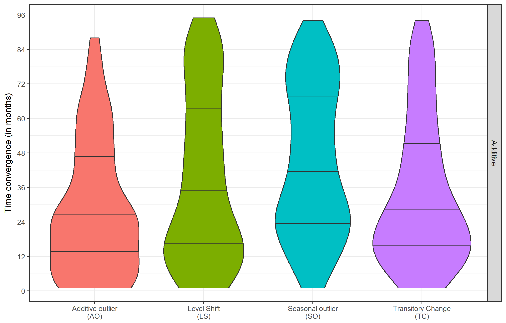

```{r setup, include=FALSE}
library(knitr)
library(kableExtra)
knitr::opts_chunk$set(echo = FALSE,warning = FALSE)
```

### Introduction à la procédure de désaisonnalisation

\centering
\includegraphics[height = 0.9\textheight]{img/MethodesX13-TS.png}

### Écriture mathématique du Reg-ARIMA
Écriture mathématique du modèle Reg-ARIMA en désaisonnalisation :

$$
 \begin{drcases}
\text{Additif : }& Y_t \\
\text{Multiplicatif : }& \log(Y_t) 
\end{drcases} 
= \underbrace{\beta_0 LY_t + \beta_1 WD_t}_{\text{Régresseurs JO}} + 
\underbrace{\sum_{i}\gamma_iO_{i,t}}_{\mathclap{\text{Ruptures}}} + \underbrace{\varepsilon_t}_{\sim ARIMA}
$$

\medskip

\pause
Objectif de l'étude : illustrer des problèmes d'instabilité des estimations avec des exemples sur :

- la correction de l'effet année bissextile (*leap year*)

- l'estimation de ruptures (*outliers*)

- l'identification du modèle ARIMA


# Correction de l'effet année bissextile

## Quand et comment corriger l'effet année bissextile ?

### Quand faut-il le corriger ?

Année bissextile (*leap year*) : un jour en plus en février $\simeq$ 4 ans

$\rightarrow$ prise en compte de l'effet « longueur du mois » : c'est un effet de calendrier


\medskip

Quand le corriger \bcquestion 

\medskip \pause

D'après les *guidelines* sur l'ajustement saisonnier, le faire lorsque :

- il y a un sens économique à le faire

- l'effet est stable et statistiquement significatif

\medskip \pause
Étude des IPI européens (1330 séries) : l'effet *leap year* existe (mais pas toujours mesurable du fait de la collecte)


### Deux méthodes pour le corriger


\begin{enumerate}
\item<1-> Avec le modèle Reg-ARIMA
\[
LY_t = \begin{cases}
0,75 & \text{ si $t$ est un mois de février bissextil} \\
-0,25  & \text{ si $t$ est un mois de février non bissextil} \\
0 & \text{ sinon}
\end{cases}
\]
\item<2-> Avec une correction \emph{a priori} en multipliant la série initiale par : 
\[\begin{cases}
\frac{28,25}{29} \simeq 0,974 & \text{ mois de février bissextil} \\
\frac{28,25}{28} \simeq 1,009 & \text{ mois de février non bissextil} \\
1 & \text{ sinon}
\end{cases}
\]
\end{enumerate}

\pause[3]

[Bell, 1992] : les deux méthodes équivalentes si schéma multiplicatif et valeur estimée proche de 0,035 ($\simeq \frac{29}{28}-1$, valeur attendue)

\pause[4]

$\rightarrow$ Étude des estimations de la 1\iere{} méthode


## Méthodologie de l'étude
### Méthodologie utilisée

Méthodologie : modèle \highlightbf{identifié} sur l'ensemble de la période (ARIMA, outliers, etc.) et estimation mois par mois sur le passé en \highlightbf{figeant} la date de début d'estimation

\pause
\medskip
On considère qu'il y a convergence lorsque le coefficient estimé reste : 

- positif

- non significativement différent de la dernière valeur

- significative : stabilité du choix de corriger


$\implies$ IPI européen : 410 séries convergent


## Exemples

### Exemples (1/2) : IPI FR-0610 (extraction de pétrole brut)

\centering
\includegraphics[width = \textwidth]{img/LYexemple1.png}

### Exemples (2/2) : IPI FR-1391 (Fabrication d'étoffes à mailles)

\centering
\includegraphics[width = \textwidth]{img/LYexemple2.png}


## Résultats des simulations
### Une convergence plutôt lente...

\centering
\includegraphics[height = 0.9\textheight]{img/LYconvergence.png}

### ... Vers une valeur pas toujours cohérente

\centering
\includegraphics[height = 0.9\textheight]{img/LYvaleur.png}

### Comparaison des deux méthodes de correction

\begin{figure}
\centering
\includegraphics[width = \textwidth]{img/LYaicc.png}
\caption{Pourcentage des séries pour lesquelles l'AICC de la méthode 2 (pré-ajustement du LY) est inférieur à l'AICC méthode 1 (régresseur LY)}
\end{figure}


# Correction des ruptures

## Les différentes ruptures étudiées

### Les principaux types d'*outliers*

\smallskip

\begin{columns}
\begin{column}{0.6\textwidth}
\textbf{Point atypique}

\emph{Additive outlier} (AO)
\end{column}
\begin{column}{0.3\textwidth}
\input{img/AO.tex}
\end{column}
\end{columns}

\begin{columns}
\begin{column}{0.6\textwidth}
\textbf{Changement de niveau}

\emph{Level Shift} (LS)
\end{column}
\begin{column}{0.3\textwidth}
\input{img/LS.tex}
\end{column}
\end{columns}


\begin{columns}
\begin{column}{0.6\textwidth}
\textbf{Rupture dans la composante saisonnière}

\emph{Seasonal Outlier} (SO) 
\end{column}
\begin{column}{0.3\textwidth}
\input{img/SO2.tex}
\end{column}
\end{columns}


\begin{columns}
\begin{column}{0.6\textwidth}
\textbf{Changement transitoire de niveau}

\emph{Transitory Change} (TC) 
\end{column}
\begin{column}{0.3\textwidth}
\input{img/TC.tex}
\end{column}
\end{columns}


## Méthodologie de l'étude
### Méthodologie utilisée

Sur les IPI européens :

1. \highlightbf{identification} et \highlightbf{estimation} du modèle sur 13 ans

2. simulation d'une rupture 5 ans après la date de début de niveau 10 pour un modèle \highlightbf{additif}

3. estimation du coefficient de la rupture en figeant les estimations de tous les autres paramètres et la date de début d'estimation


On considère qu’il y a convergence lorsque : 
$$\left\lvert\frac{\text{valeur estimée}}{\text{dernière valeur estimée}}-1\right\rvert < 5\;\%$$

## Exemple
### Exemple d'un AO pour la série IPI IT-1413 (Fabrication de vêtements de dessus)

\centering

\includegraphics[width=0.95\textwidth]{img/AO_ipi_it1413_y.png}

\includegraphics[width=0.95\textwidth]{img/AO_ipi_it1413_est.png}


## Résultats des simulations
### Une convergence plutôt lente...

\centering
{width=100%}\


### ... Mais pas toujours vers la bonne valeur


\centering

\begin{tabular}{lccccc}\toprule
  & Minimum & 25   \% & 50   \% & 75   \% & Maximum\\\midrule
\addlinespace[0.3em]\multicolumn{6}{l}{\textbf{Modèles additifs}}\\
\hspace{1em}Additive outlier (AO) & -73,4 & 8,0 & 11,0 & 14,4 & 45,9\\
\hspace{1em}Level Shift (LS) & -33,9 & 6,3 & 9,2 & 12,8 & 95,0\\
\hspace{1em}Seasonal outlier (SO) & -83,5 & 5,9 & 8,1 & 10,4 & 34,3\\
\hspace{1em}Transitory Change (TC) & -56,9 & 6,9 & 10,2 & 14,2 & 133,5\\\addlinespace[0.3em]
\bottomrule\end{tabular}


# Identification du modèle ARIMA

### Identification de deux modèles équivalents

On reprend le même modèle de base sous deux formes différentes mathématiquement équivalentes :

1. Le régresseur *leap year* intégré dans le système des régresseurs jours ouvrables

2. Le régresseur *leap year* introduit comme régresseur externe

$\rightarrow$ étude du modèle automatique

### Modèles automatiques différents

\centering
\includegraphics[width = \textwidth]{img/CholeskyRF241.png}


# Conclusion et recommandations

### Conclusion et recommandations (1/2)


\medskip

\bcinfo Simulations \highlightbfslide{1}{critiquables} et \highlightbfslide{1}{améliorables} mais mettent en évidence la \highlightbfslide{1}{potentielle instabilité} des modèles Reg-ARIMA souvent utilisés comme boîtes noires 

\medskip  \pause
\bcsmbh Instabilités ont un \highlightbfslide{2}{effet limité} sur la CVS-CJO\dots \bcsmmh mais ont un effet sur l'histoire à \highlightbfslide{2}{court terme} et sur les \highlightbfslide{2}{révisions} !

\medskip  \pause
\bcattention Algorithmes automatiques des méthodes X-13ARIMA-SEATS et TRAMO-SEATS très \highlightbfslide{3}{importants} et très \highlightbfslide{3}{utiles}


### Conclusion et recommandations (2/2)

Spécifier le modèle \highlightbf{au préalable} au niveau de la \highlightbf{série} :

- baser les procédures de choix en s'appuyant sur un raisonnement d'abord économique (attention aux séries trop longues)

- \bcinterdit ne pas utiliser les méthodes comme des boîtes noires... \pause Sinon, vous serez comme ce statisticien qui...


### Merci de votre attention  {.noframenumbering}

\begin{quote}
« Il se sert des statistiques comme un ivrogne d'un réverbère : pour se soutenir et non pour s'éclairer. »
\end{quote}
Citation largement attribuée à Andrew Lang (1844-1912)

\addtocounter{framenumber}{-1}
